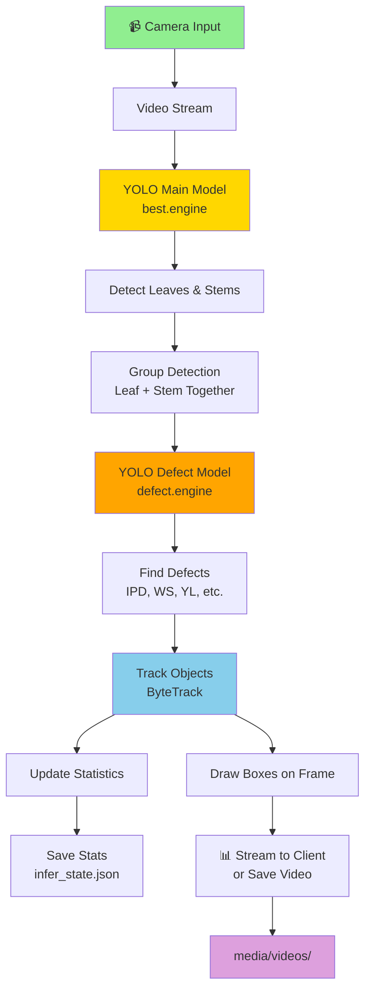

# 🌱 Exceed-Backend
---

## 🎯 What Does This Do?

This system helps you:
- **Detect Plants**: Find spinach leaves and stems in video
- **Find Problems**: Spot diseases and defects on plants (like IPD, leaf spots, etc.)
- **Track Plants**: Keep track of the same plant across video frames
- **Record Videos**: Save the camera feed with detection boxes
- **Control Cameras**: Change camera settings like brightness and focus

---

## 🔄 How It Works



---

## 📁 What's Inside

### Main Code
- **`infer_2model.py`** - Runs the AI models for detection
  - Loads two YOLO models (main + defect)
  - Groups leaves with their stems
  - Tracks and counts objects
  - Filters bad detections

- **`server.py`** - Web server for camera control
  - Connects to cameras
  - Streams live video
  - Records videos
  - Stores settings

### Important Files
- **`best.engine`** - Main AI model (detects leaves and stems)
- **`defect.engine`** - Defect AI model (finds plant diseases)
- **`camera_settings.json`** - Saved camera settings
- **`infer_state.json`** - Saved statistics

### Folders
- **`media/images/`** - Saved photos from camera
- **`media/videos/`** - Saved videos
- **`runs/detect/predict/`** - Detection results
- **`trackers/`** - Tracking config for ByteTrack
- **`local_video/`** - Sample videos for testing

---

## 🚀 Quick Start

### Install
```bash
bash install.sh
```

### Run the Server
```bash
python server.py
```

The server starts at: `http://localhost:8000`

---

## 📡 API Endpoints

### Camera
- `GET /camera/settings` - Get current camera settings
- `POST /camera/settings` - Change camera settings

### Video Stream
- `GET /stream` - Watch live video in real-time
- `GET /stream/mode` - Check stream mode (raw or detected)
- `POST /stream/mode` - Change stream mode

### Recording
- `POST /record/start` - Start recording a video
- `POST /record/stop` - Stop recording

### Detection Stats
- `GET /infer/stats` - Get tracking statistics
- `GET /capture` - Take a photo

### Other
- `POST /save-local` - Save uploaded file
- `POST /log` - Send log messages

---

## ⚙️ How to Use

### 1. Stream Video
Get live video from camera with detection boxes:
```
http://localhost:8000/stream
```

### 2. Change Camera Settings
Update brightness, focus, white balance:
```bash
curl -X POST http://localhost:8000/camera/settings \
  -H "Content-Type: application/json" \
  -d '{"exposure_us": 20000000, "gain": 1.0}'
```

### 3. Record Video
Start and stop video recording:
```bash
# Start
curl -X POST http://localhost:8000/record/start \
  -H "Content-Type: application/json" \
  -d '{"mode": "raw"}'

# Stop
curl -X POST http://localhost:8000/record/stop
```

### 4. Get Statistics
See how many plants were detected:
```bash
curl http://localhost:8000/infer/stats
```

---

## 🎨 Detection Colors

When you watch the stream, you'll see:
- **🟩 Green Box** = Leaf or Spinach
- **🟩 Light Green Box** = Stem
- **🔴 Red Box** = Plant defect (disease or problem)

---

## 📊 What Gets Detected

### Objects
- **Leaf** / **Spinach** - Plant leaves
- **Stem** / **Leaf Stem** - Plant stems

### Defects (Problems)
- **IPD** - Internal plant disease
- **IPD2** - Another type of disease
- **WS** - White spot disease
- **WS2** - Another white spot
- **YL** - Yellow leaf disease

---

## ➖ Size Filters

The system only keeps detections of the right size:

| Object | Height | Width |
|--------|--------|-------|
| Leaf | 40-70mm | 25-50mm |
| Stem | 5-30mm | 2-10mm |

---

## 🔧 Settings You Can Change

Edit `camera_settings.json`:
```json
{
  "wbmode": 5,
  "exposure_us": 20000000,
  "gain": 1.0,
  "aelock": true,
  "camera_mode": "single"
}
```

- **wbmode** - White balance (1-10)
- **exposure_us** - Brightness (in microseconds)
- **gain** - Image amplification
- **aelock** - Lock auto-exposure
- **camera_mode** - "single" or "dual" camera

---

## 📝 Statistics Stored

After detection, this info is saved:
- Number of leaves found
- Number of defects found (by type)
- Tracking IDs for each plant
- Detection confidence scores
- Box coordinates

Saved in: `infer_state.json`

---

## 🔌 What's Required

- **Python 3.8+**
- **FastAPI** - Web server
- **OpenCV** - Video processing
- **YOLOv8** - Object detection
- **GStreamer** - Camera streaming (for Raspberry Pi)
- **FFmpeg** - Video encoding

---

## 📸 Technical Details

### Models
- Uses YOLO 8 (You Only Look Once v8)
- Models are in TensorRT format (`.engine` files)
- Optimized for fast detection

### Tracking
- ByteTrack algorithm
- Keeps track of same object across frames
- Helps count unique plants

### Cameras
- Supports single or dual camera setup
- Uses Nvidia Argus for camera control
- Streams at 30 FPS

---

## 🐛 Troubleshooting

**No camera found?**
- Check USB connection
- Check `/dev/video0` or `/dev/video1` exist

**Models won't load?**
- Ensure `best.engine` and `defect.engine` exist
- Check YOLO is installed correctly

**Slow detection?**
- Reduce frame size in settings
- Lower FPS rate
- Use GPU acceleration

---

## 📄 License

Internal project - Exceed

---

## 👨‍💻 Version Control

When code updates:
1. New versions auto-update this README
2. Statistics stay in `infer_state.json`
3. Camera settings saved in `camera_settings.json`

No manual tracking needed! 📦

---

**Happy plant detection! 🌱✨**
