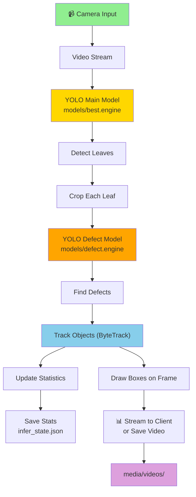

# 🌱 Exceed-Backend

A smart plant detection system that uses AI cameras to detect leaves and plant defects in real time, stream video, and manage recordings.

---

## 🎯 What Does This Do?

This system helps you:
- **Detect Leaves**: Find spinach leaves in video
- **Find Problems**: Spot plant defects (IPD, WS, YL, etc.)
- **Track Plants**: Track the same leaf across frames
- **Record Videos**: Save the camera feed (raw or inferred)
- **Control Cameras**: Change camera settings (exposure, gain, WB)

---

## 🔄 How It Works (Updated)



**Note:** Grouping logic was removed. The main model now detects **leaves only**, and each leaf is sent to the defect model.

---

## 📁 File Structure (Updated)

### Main Entry Points
- `server.py` — FastAPI server (stream, record, camera settings)
- `infer_main.py` — Inference entrypoint (public API)

### Inference Modules
- `infer/models.py` — Model loading + paths
- `infer/core.py` — Detection extraction + leaf selection + defect inference
- `infer/draw.py` — Drawing leaf/defect boxes
- `infer/stats.py` — Tracking + summaries

### Models
- `models/best.engine` — Main YOLO model (leaf detection)
- `models/defect.engine` — Defect YOLO model

### Config & State
- `server_config.json` — Exceed mode toggle
- `camera_settings.json` — Camera settings
- `infer_state.json` — Saved stats

### Media & Data
- `media/images/` — Captured images
- `media/videos/` — Recorded videos
- `local_video/` — Sample video input
- `trackers/` — ByteTrack config

---

## 🚀 Quick Start

### Install
```bash
bash install.sh
```

### Run the Server
```bash
python server.py
```

Server starts at: `http://localhost:8000`

---

## ⚙️ Exceed vs Imager Mode

Mode is controlled by `server_config.json`:
```json
{
  "exceed_enabled": false
}
```

- **Imager mode**: stream + capture + raw recording only
- **Exceed mode**: enables infer, stats, and infer recording

---

## 📡 API Endpoints

### Camera
- `GET /camera/settings` — Get current camera settings
- `POST /camera/settings` — Update camera settings (form-data)

### Video Stream
- `GET /stream` — Live MJPEG stream
- `GET /stream/mode` — Check stream mode (raw | infer)
- `POST /stream/mode` — Change mode / source (Exceed only)

### Recording
- `POST /record/start` — Start recording
- `POST /record/stop` — Stop recording
- `GET /record/start` — GET alias (Imager compatibility)
- `GET /record/stop` — GET alias (Imager compatibility)

### Detection Stats (Exceed)
- `GET /infer/stats` — Tracking statistics

### Other
- `GET /capture` — Capture image
- `POST /save-local` — Save uploaded file
- `POST /log` — Log message from frontend

---

## 🔧 Camera Settings

**Get current settings**
```bash
curl http://localhost:8000/camera/settings
```

**Update settings (form-data)**
```bash
curl -X POST http://localhost:8000/camera/settings \
  -F wbmode=5 \
  -F exposure_us=20000000 \
  -F gain=1.0 \
  -F aelock=true \
  -F camera_mode=single
```

**Behavior**
- If `camera_mode` changes, cameras are rebuilt
- Otherwise, cameras restart in place

---

## 📊 Statistics Saved

Stats are stored in `infer_state.json`:
- total leaves
- total defects
- defect counts per class
- per-track sizes

---

## 🔌 Requirements

- **Python 3.8+**
- **FastAPI**
- **OpenCV**
- **YOLOv8**
- **GStreamer** (camera input)
- **FFmpeg** (recording)

---

## 🐛 Troubleshooting

**No camera found?**
- Check `/dev/video0` or `/dev/video1`

**Models won't load?**
- Ensure `models/best.engine` and `models/defect.engine` exist

**Slow detection?**
- Lower FPS or resolution
- Use GPU acceleration

---

## 📄 License

Internal project - Exceed
